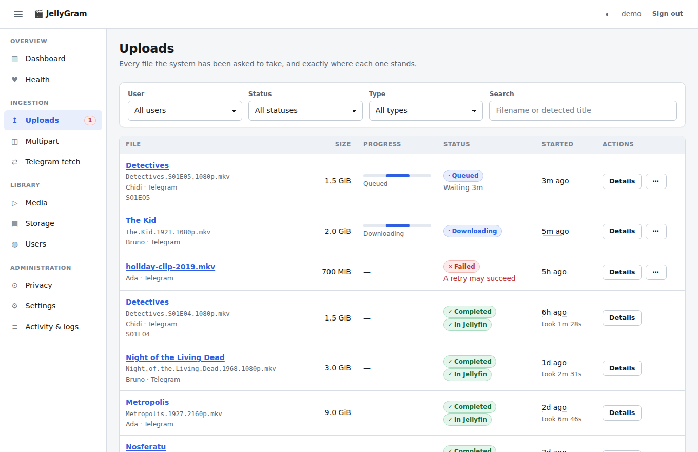
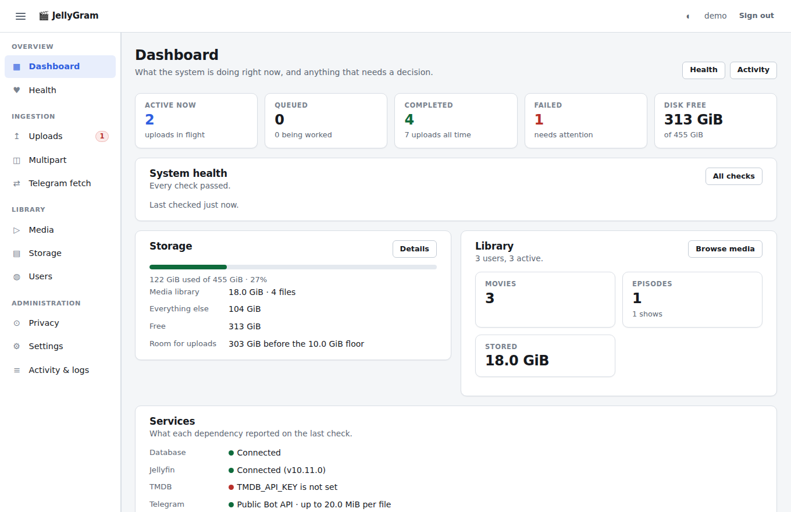
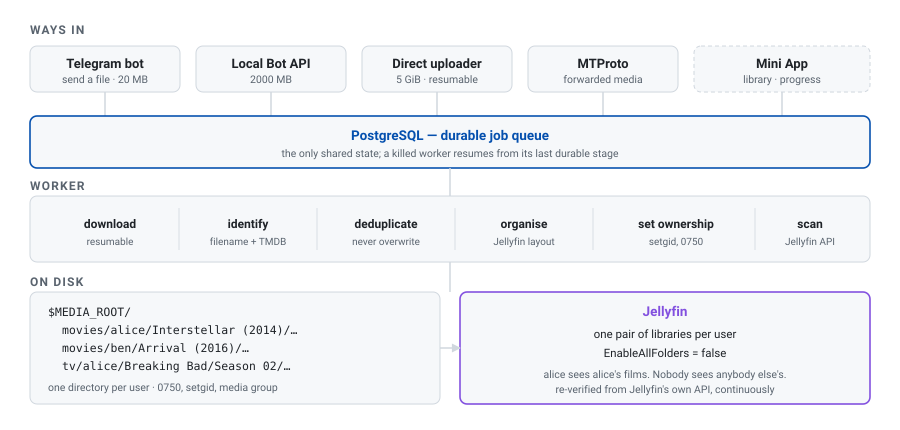
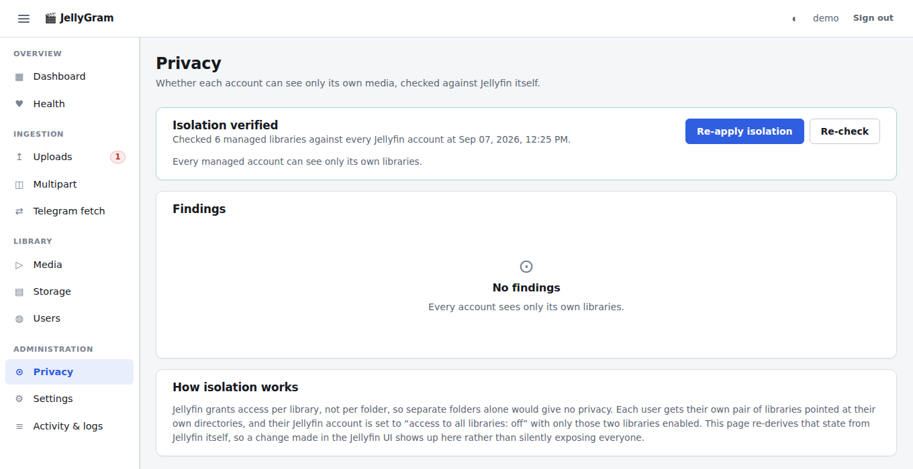

<h1 align="center">JellyGram</h1>

<p align="center">
  <strong>A self-hosted Telegram bot and Mini App for managing and uploading media to Jellyfin.</strong>
</p>

<p align="center">
  Send a film to your bot. It lands in your own private Jellyfin library —<br>
  correctly named, correctly filed, and invisible to everyone else on the server.
</p>

<p align="center">
  <a href="https://github.com/NahomHabtamuNSC/jellygram/actions/workflows/ci.yml"></a>
  <a href="LICENSE"></a>
  
  
  
  
</p>

<p align="center">
  
</p>

**What JellyGram is.** Three small services and a browser UI that sit between
Telegram and a Jellyfin server you already run. People send you video files in a
Telegram chat, or upload them through a Mini App on their phone; JellyGram
identifies each one, files it into the layout Jellyfin expects, and puts it in a
library only that person can see. Everything runs on your machine — no cloud
service in the middle, no account anywhere but your own server, and no third
party ever holds your media.

**Who it is for.** Anyone running Jellyfin for more than one person — a
household, a few friends — who is tired of being the only one who can add
anything to it. Give somebody a Telegram account and a Jellyfin account, and
they can add their own films without touching your server, without an SSH key,
and without seeing anybody else's library.

**Why it exists.** Jellyfin grants access per *library*, not per folder, so
"just give everyone their own directory" gives you no privacy at all. Getting
this right means creating a library per user and constraining each account to
it — then checking, continuously, that it is still true. That check is the
thing this project is actually built around; the Telegram bot is how the media
gets in. See [Why per-user privacy is the hard part](#why-per-user-privacy-is-the-hard-part).

## Contents

- [What it does](#what-it-does)
- [Architecture](#architecture)
- [Why per-user privacy is the hard part](#why-per-user-privacy-is-the-hard-part)
- [Requirements](#requirements)
- [Quick start](#quick-start)
- [Configuration](#configuration)
- [Adding a user](#adding-a-user)
- [Sending media](#sending-media)
- [Large files](#large-files)
- [The Telegram Mini App](#the-telegram-mini-app)
- [Running it](#running-it)
- [Development](#development)
- [Testing](#testing)
- [Deployment](#deployment)
- [Troubleshooting](#troubleshooting)
- [Security](#security)
- [Documentation](#documentation)
- [Contributing](#contributing)
- [Licence](#licence)

---

## What it does

- **A Telegram bot** that accepts MP4, MKV, AVI and MOV from registered users
  only. Everything else — including subtitle files — is refused with a reason.
- **Identification.** The filename is parsed, then confirmed against TMDB when a
  key is configured. `Interstellar.2014.1080p.BluRay.mkv` becomes
  *Interstellar (2014)*; `Breaking.Bad.S02E03.1080p.mkv` becomes
  *Breaking Bad*, season 2, episode 3. What the parser cannot place confidently
  is quarantined for review rather than guessed at.
- **Organisation** into the layout Jellyfin expects:

  ```
  movies/alice/Interstellar (2014)/Interstellar (2014).mkv
  tv/alice/Breaking Bad/Season 02/Breaking Bad - S02E03.mkv
  ```

- **Per-user privacy** — each user gets their own directories *and* their own
  Jellyfin libraries, and their Jellyfin account is restricted to those
  libraries. The dashboard re-verifies this from Jellyfin itself, continuously.
- **An admin dashboard** — users, uploads, media, storage, a privacy audit,
  health, settings and logs. Plain HTML, CSS and JavaScript: no build step, no
  bundler, no CDN.

  

- **A Telegram Mini App** — the same library, uploads and live progress, inside
  Telegram, on a phone.
- **Four ways in for large files**, because Telegram will not hand a bot
  anything over 20 MB by default. See [Large files](#large-files).
- **Durable jobs.** The queue is PostgreSQL. A worker killed mid-download
  resumes from its last durable stage; it does not re-download a finished file,
  and it does not mistake its own earlier work for a duplicate.
- **Safety by default.** Filenames are sanitised and cannot escape the media
  root, free disk is checked before a download starts, duplicates are detected
  rather than overwritten, and nothing is ever deleted to make room.

## Architecture

<picture>
  <source media="(prefers-color-scheme: dark)" srcset="docs/images/architecture-dark.svg">
  
</picture>

Three processes share nothing but the database, so a multi-gigabyte download
cannot stop the bot from answering or the dashboard from rendering. The queue is
PostgreSQL rather than Redis or a message broker: the state you have to be able
to reason about after a crash is already in the database that holds everything
else. [docs/architecture.md](docs/architecture.md) goes through the pipeline
stage by stage, and explains what each one does on a restart.

## Why per-user privacy is the hard part

Separate folders give you **no** privacy in Jellyfin. Access is granted per
*library*, and any account with "access to all libraries" sees every file on the
server no matter which directory it sits in. So this application does three
things, and the third is the one that matters:

1. Each user gets their own directory under `movies/` and `tv/`.
2. Each user gets their own **pair of Jellyfin libraries** pointed at exactly
   those directories.
3. Each user's Jellyfin account is set to **`EnableAllFolders = false`** with
   only their own two libraries enabled.

The dashboard's *Privacy* page re-derives the current state from Jellyfin's own
API — not from this application's database — so a change somebody made in the
Jellyfin UI is reported rather than silently trusted. `npm run jellyfin:audit`
runs the same check from a terminal and exits non-zero when isolation is broken;
`npm run jellyfin:audit -- --fix` repairs it.



On disk the tree is `0750 <you>:<media group>` with the setgid bit, so Jellyfin
can read it and no other local account can.

## Requirements

| Component | Version | Notes |
| --- | --- | --- |
| Node.js | 22 or newer | `node -v` |
| PostgreSQL | 14 or newer | Or use the bundled `docker-compose.yml` |
| Jellyfin | 10.8 or newer | Tested against 10.10 and 10.11 |
| Linux | any current distribution | Developed on Ubuntu; nothing is distro-specific |
| ffprobe | optional | Validates that an upload really is a video. Found automatically if Jellyfin's bundled ffmpeg is present |
| Docker | optional | Only for the PostgreSQL and local Bot API containers |

Jellyfin does **not** have to be on the same machine, but the worker does have
to be able to write to the media tree Jellyfin reads.

## Quick start

```bash
git clone https://github.com/NahomHabtamuNSC/jellygram.git
cd jellygram
npm ci
```

**1. Configuration.** This writes `.env` (mode 0600) and generates a session
key for you:

```bash
npm run init
```

Then open `.env` and set at least `DATABASE_URL` and `MEDIA_ROOT`. Every
variable is documented in place; [docs/configuration.md](docs/configuration.md)
is the same information organised by topic.

**2. A database.** Either point `DATABASE_URL` at a PostgreSQL you already run,
or start the bundled one — set `POSTGRES_PASSWORD` in `.env` first:

```bash
npm run db:up
```

**3. Build and create the schema.**

```bash
npm run build
npm run migrate
```

**4. Credentials.** The guided setup prompts for the bot token, creates a
Jellyfin API key for you, and takes an optional TMDB key. Nothing is echoed to
the terminal or left in shell history:

```bash
npm run setup
```

**5. A dashboard login.**

```bash
npm run admin:create
```

**6. Start it.**

```bash
npm run start:api      # dashboard + API on ADMIN_PORT (8300 by default)
npm run start:worker   # the job runner
npm run start:bot      # the Telegram bot
```

Three terminals for now; [deploy/](deploy/README.md) turns them into systemd
services. Open `http://127.0.0.1:8300` and sign in.

You do not need a bot token to get this far — the API and worker run without
one, and the bot process exits cleanly and says so.

## Configuration

Everything lives in `.env`. `.env.example` documents every variable where it is
defined, grouped as required, optional, per-feature, production, and
development-only.

The four values the application will not start without:

| Variable | What it is |
| --- | --- |
| `DATABASE_URL` | A PostgreSQL database this application owns |
| `ADMIN_SESSION_SECRET` | Signs dashboard sessions. `npm run init` generates one |
| `TELEGRAM_BOT_TOKEN` | From [@BotFather](https://t.me/BotFather). The bot process needs it; the others do not |
| `JELLYFIN_API_KEY` | From Jellyfin, or created by `npm run setup` |

A malformed value is a startup error, not a silent default: the process prints
exactly which variables were wrong and exits 78 (`EX_CONFIG`).
`ADMIN_COOKIE_SECURE=ture` used to mean `false`; now it means "stop".

Every setting is declared in `src/config/index.ts` and documented in
`.env.example`, so those two files are the complete configuration surface. The
single exception is deliberate and documented: `jellyfin:bootstrap` accepts a
Jellyfin administrator password through `JELLYFIN_ADMIN_PASSWORD` for one
unattended command, precisely so it does not have to live in `.env`.

- [docs/configuration.md](docs/configuration.md) — every variable, by topic
- [docs/telegram.md](docs/telegram.md) — creating the bot, IDs, the Mini App
- [docs/jellyfin.md](docs/jellyfin.md) — API key, permissions, what gets created
- [docs/database.md](docs/database.md) — role, database, migrations, backups
- [docs/networking.md](docs/networking.md) — LAN, VPN and internet addresses

## Adding a user

1. **In Jellyfin**, create the account yourself (Dashboard → Users → +). This
   application never creates Jellyfin accounts. Make it a **normal user**, not
   an administrator — administrators see every library by design, and no
   setting here can override that.
2. Ask the person to send `/start` to your bot. The reply ends with their
   Telegram ID.
3. **In the dashboard**, *Users* → *Add user*: their name, that Telegram ID,
   and their Jellyfin username.

The application then creates their media directories, creates two Jellyfin
libraries pointed at them, and restricts their Jellyfin account to exactly those
two. Check the *Privacy* page afterwards; it should read **Isolation verified**.

## Sending media

Send a video file to the bot in a private chat. Name it clearly:

```
Interstellar.2014.1080p.BluRay.mkv
Breaking.Bad.S02E03.1080p.mkv
The.Office.3x07.mkv
```

The bot replies with one message and edits it as work progresses — received,
downloading with a progress bar and ETA, processing, organising, adding to
Jellyfin, done. Commands: `/start`, `/status`, `/library`, `/help`.

## Large files

Telegram's public Bot API refuses to hand a bot any file over **20 MB**. That is
Telegram's limit, not a setting. Four routes get past it; pick whichever suits
how your media reaches you. The first row is the default, and the one you are
trying to escape.

| Route | Ceiling | When it applies |
| --- | --- | --- |
| Public Bot API | 20 MB | The default. Works out of the box, and stops here |
| **Local Bot API server** | 2000 MB | You send files *to* the bot. A `docker compose up` away |
| **Direct uploader** | 5 GiB | The media is already on a machine you control |
| **Multi-part send** | 5 GiB | Split by hand, sent as `.part1`, `.part2`, … , then `/finish` |
| **MTProto** | 5 GiB | You *forward* media that is already in Telegram |

The direct uploader (`uploader/jellygram-upload.mjs`) is one dependency-free
file you copy to wherever your films are. It picks single or multi-part by
itself,
resumes an interrupted transfer, retries a failed part, and writes no temporary
files — parts are read as byte ranges straight from the original, which is
opened read-only.

Every route ends in the same pipeline: identification, duplicate detection, the
Jellyfin layout, the library scan, your own private library.

Full detail, including how to set up each one: [docs/large-files.md](docs/large-files.md).

## The Telegram Mini App

A second interface running inside Telegram: your library with posters, an upload
button, live transfer progress, and your history. Same accounts, same pipeline,
same private libraries — a different door, not a different system.

Telegram only opens **https** addresses, so it stays off until `MINIAPP_URL`
names one. [docs/networking.md](docs/networking.md) covers the ways to get one
(reverse proxy with a real certificate, an outbound tunnel, Tailscale Funnel)
and what each exposes. The authentication model — how a signed `initData` blob
becomes a session, and why it is verified rather than trusted — is in
[docs/miniapp.md](docs/miniapp.md).

## Running it

Three processes, sharing nothing but the database:

| Process | What it does | If it stops |
| --- | --- | --- |
| `api` | Dashboard, admin API, upload ingest | The dashboard is down; queued work continues |
| `bot` | Long-polls Telegram | New sends are not received; nothing is lost |
| `worker` | Runs the pipeline; the only writer to the media tree | Jobs wait; a restart resumes them |

They are separate on purpose: a multi-gigabyte download must not stop the bot
from answering or the dashboard from rendering.

```bash
npm run start:api
npm run start:bot
npm run start:worker
```

For a real deployment, see [deploy/README.md](deploy/README.md) — templated
systemd units, an installer that fills them in for your machine, a reverse-proxy
example, and the backup timer.

## Development

```bash
npm run check     # typecheck, no emit
npm run build     # compile src → dist
npm run migrate   # apply new migrations
```

The frontend has no build step. `public/` is what the browser gets: edit a file,
reload the page.

Useful scripts:

| Command | What it does |
| --- | --- |
| `npm run admin:create` | Create or reset a dashboard administrator |
| `npm run jellyfin:bootstrap` | Create the Jellyfin API key from an admin login |
| `npm run jellyfin:audit` | Verify per-user isolation; `-- --fix` repairs it |
| `npm run media:repair` | Re-apply group ownership and modes to the media tree |
| `npm run upload:token` | Issue or revoke a token for the direct uploader |
| `npm run upload:diagnose` | Why a specific upload failed, by stage |
| `npm run db:backup` | Gzipped `pg_dump` into `BACKUP_DIR` |

## Testing

```bash
npm run build:tests && npm test    # 426 unit and integration tests
npm run test:frontend              # dashboard and Mini App UI in jsdom
npm run test:e2e                   # the whole pipeline against a real video
npm run test:all                   # everything
```

The suite is self-isolating and needs **no** credentials. It creates its own
scratch database (`jellygram_test`) beside the one `DATABASE_URL` names, writes
only into `.test-media/`, and supplies its own fake bot token and Jellyfin key —
pointing both at a dead port, so a test that forgot to stub `fetch` fails loudly
instead of reaching your real server.

Only PostgreSQL is required. [docs/testing.md](docs/testing.md) explains how
the isolation works and what the optional browser suites need.

## Deployment

[deploy/README.md](deploy/README.md) covers systemd user units, the reverse
proxy, backups, upgrades, and the optional Jellyfin country fence.

The short version:

```bash
npm ci && npm run build && npm run migrate
./deploy/install-systemd.sh
sudo loginctl enable-linger "$USER"
systemctl --user enable --now jellygram-api jellygram-worker jellygram-bot jellygram-backup.timer
```

## Troubleshooting

| Symptom | Cause and fix |
| --- | --- |
| A process exits immediately with a list of variables | Configuration error (exit 78). It names exactly what was wrong. |
| Bot exits 0 saying it has no token | Expected. Set `TELEGRAM_BOT_TOKEN`, or run the other two without it. |
| "You are not registered" | Expected for unknown Telegram IDs. Add the user in the dashboard. |
| "Telegram will not let this bot download…" | The file is over 20 MB and no local Bot API server is configured. See [Large files](#large-files). |
| Uploads stuck in `QUEUED` | The worker is not running, or `QUEUE_PAUSED=true`. |
| Media on disk but not in Jellyfin | Almost always group ownership. `npm run media:repair`, then `npm run jellyfin:reverify`. |
| Privacy page shows errors | *Re-apply isolation*, or `npm run jellyfin:audit -- --fix`. |
| Sign-in fails over HTTPS behind a proxy | `ADMIN_COOKIE_SECURE` and `TRUST_PROXY` must both be true, and TLS must actually work first. |
| An upload sits on "Awaiting review" | The parser was not confident enough to file it. Rename it closer to the release title and send it again. |
| No health alerts arrive | `TELEGRAM_ADMIN_CHAT_ID` is unset. The Health page says so. |

More, with the reasoning: [docs/troubleshooting.md](docs/troubleshooting.md).

## Security

- Dashboard passwords are hashed with **scrypt**; only the SHA-256 of a session
  token is stored, so a database leak hands out no live sessions.
- Mini App `initData` is verified against the bot token with a constant-time
  comparison, is bound to the signing bot, and expires.
- Every non-`GET` admin route requires a CSRF token; login is rate-limited per
  client and per account.
- Every path that reaches the filesystem is re-checked with `assertInside`
  before it is used. Path traversal is treated as an incident, not a 400.
- No shell is ever invoked with user input; `execFile` with an argument array
  throughout.
- Secrets are read from `.env` only, are never logged, and are redacted from
  error messages before they are recorded.

[docs/security.md](docs/security.md) has the full model, including what this
application deliberately does *not* defend against. Please report
vulnerabilities privately — see [SECURITY.md](SECURITY.md).

## Documentation

| Document | Covers |
| --- | --- |
| [docs/architecture.md](docs/architecture.md) | Processes, the pipeline, the queue, restart safety, design decisions |
| [docs/configuration.md](docs/configuration.md) | Every environment variable, by topic |
| [docs/database.md](docs/database.md) | Schema, constraints, migrations, backup and restore |
| [docs/telegram.md](docs/telegram.md) | Bot creation, IDs, commands, Mini App registration |
| [docs/jellyfin.md](docs/jellyfin.md) | API key, permissions, libraries, the isolation model |
| [docs/networking.md](docs/networking.md) | LAN, VPN and internet addresses; HTTPS for the Mini App |
| [docs/large-files.md](docs/large-files.md) | All four routes past Telegram's limits |
| [docs/miniapp.md](docs/miniapp.md) | Authentication, what the client may ask for, deployment |
| [docs/api.md](docs/api.md) | Admin and Mini App HTTP reference |
| [docs/testing.md](docs/testing.md) | How the suite isolates itself; running each suite |
| [docs/security.md](docs/security.md) | Threat model, controls, and the limits of them |
| [docs/troubleshooting.md](docs/troubleshooting.md) | Symptoms, causes, and the diagnostics to run |
| [deploy/README.md](deploy/README.md) | systemd, reverse proxy, backups, upgrades |

## Contributing

Issues and pull requests are welcome. [CONTRIBUTING.md](CONTRIBUTING.md) has the
setup, the conventions this codebase actually follows, and what a good change
looks like here.

## Licence

[MIT](LICENSE).

This project is not affiliated with Telegram, Jellyfin or TMDB. It is a client
of their public APIs and is subject to their terms — in particular, MTProto
ingestion authenticates as *your own* Telegram account, so read
[docs/large-files.md](docs/large-files.md#4-mtproto-ingestion) before enabling it.
