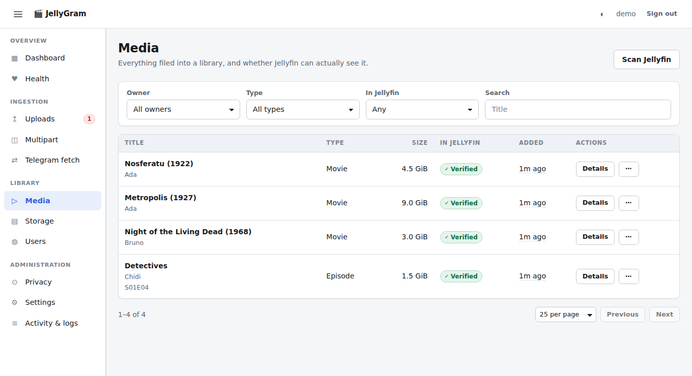

# Jellyfin setup

Tested against Jellyfin 10.8 – 10.11. Nothing here uses a plugin or an
undocumented endpoint.

## 1. The API key

```bash
npm run jellyfin:bootstrap
```

It asks for a Jellyfin **administrator** username and password, exchanges them
for a long-lived API key named `JellyGram`, writes that key into
`.env`, and logs the temporary session out. The password is used once and is
never stored, logged or echoed. `npm run setup` offers the same thing as part of
the guided flow.

Or create it by hand: Jellyfin → *Dashboard* → *API Keys* → **+**, then paste it
into `.env` as `JELLYFIN_API_KEY`.

Unattended, for a scripted first run:

```bash
JELLYFIN_ADMIN_PASSWORD='…' npm run jellyfin:bootstrap -- --user jellyfin-admin
```

`JELLYFIN_ADMIN_PASSWORD` is the one setting this project reads from the
environment rather than from `.env`, and that is on purpose: it is a live
Jellyfin administrator password wanted for exactly one call. Keeping it out of
`.env` means it is not left on disk afterwards. Prefer the interactive prompt
unless you are automating; a value passed this way is visible to anything that
can read your shell history or this process's environment.

The key must belong to an administrator, because creating libraries and setting
another account's access policy are administrative operations. There is no
narrower Jellyfin permission that covers them.

## 2. Addresses

Two settings, and they are usually **different**:

```env
# How this server reaches Jellyfin. Usually loopback.
JELLYFIN_URL=http://127.0.0.1:8096

# How a person's browser reaches it.
JELLYFIN_PUBLIC_URL=http://192.0.2.10:8096
```

Handing a phone `http://127.0.0.1:8096` points it at the phone. `JELLYFIN_URL`
is the address the API and worker use; `JELLYFIN_PUBLIC_URL` is what the Mini
App offers as "Open Jellyfin". Leave the public one empty only when the two
genuinely coincide.

Two more are optional, and let the Mini App find its way from anywhere:

```env
JELLYFIN_TAILSCALE_URL=https://jellyfin.tailnet.ts.net:8443
JELLYFIN_INTERNET_URL=https://jellyfin.example.com
```

See [networking.md](networking.md) for how they are probed.

## 3. Media directory permissions

Jellyfin runs as its own system account and needs to **read** your media tree.
This application needs to **write** it. Nobody else should do either.

```bash
sudo mkdir -p /srv/media/{movies,tv,.incoming,.quarantine}
sudo chown -R "$USER":jellyfin /srv/media
sudo chmod 2750 /srv/media /srv/media/movies /srv/media/tv
```

Three details, each of which has caused a silent failure:

**Every level needs the group, not just the leaf.** Jellyfin has to traverse
`movies/<user>/` to reach the title directory inside it. `mkdir -p` creates
intermediate directories with the *caller's* primary group, so a tree built
carelessly ends up with a correct leaf under an unreadable parent, and Jellyfin
logs *"Library folder … is inaccessible or empty, skipping"*.

**The setgid bit (`2750`) is what keeps it correct.** New entries inherit the
directory's group automatically. This is not a nicety — the worker runs under
`PrivateTmp=true`, in a mount namespace where the Jellyfin gid may be unmapped,
and `chown` to an unmapped gid fails with `EINVAL`. Setgid works regardless.

**Every parent directory must be traversable.** If your media lives under your
home directory, that home directory needs at least `drwxr-x--x` so the Jellyfin
account can pass through it. `/srv/media` avoids the question entirely.

Check and repair at any time:

```bash
npm run media:repair       # re-apply modes and group across the whole tree
npm run jellyfin:reverify  # re-scan and re-check every unverified item
```

Set `MEDIA_GROUP=` (empty) to disable group management altogether — appropriate
when everything runs as one uid, as in a single-user container.

## 4. What the application creates

For a user whose storage slug is `alice`:

| Jellyfin library | Type | Path |
| --- | --- | --- |
| `Movies - Alice` | `movies` | `$MOVIES_ROOT/alice` |
| `TV Shows - Alice` | `tvshows` | `$TV_ROOT/alice` |

(`JELLYFIN_LIBRARY_PREFIX` prepends a string, so `TG` gives `TG Movies -
Alice` — useful when Jellyfin also holds libraries you curate by hand.)

It then sets that user's policy to `EnableAllFolders = false` with
`EnabledFolders` containing exactly those two library ids.

### What it never does

- **It never creates, deletes or modifies Jellyfin accounts.** You create them;
  this application grants and restricts access to libraries. Account creation
  would mean holding credentials that can create administrators.
- **It never restarts Jellyfin.** Visibility comes from a targeted
  `POST /Items/{id}/Refresh` followed by `POST /Library/Refresh`.
- **It never deletes media files.** Removing a user removes their libraries and
  their database records; the files stay on disk.

## 5. The isolation model

This is the point of the whole project, so it is worth being precise.

Separate folders give you **no** privacy in Jellyfin. Access is granted per
*library*, and an account with "access to all libraries" sees every file on the
server regardless of which directory it is in. Three things together produce
isolation, and only the third enforces it:

1. Each user gets their own directory under `movies/` and `tv/`.
2. Each user gets their own **pair of libraries** pointed at those directories.
3. Each user's account gets `EnableAllFolders = false` and only those two
   libraries in `EnabledFolders`.

**Administrators see everything, by design.** No setting here changes that. Make
media users *normal* users. If you administer Jellyfin from the same account you
watch from, you have no isolation and the audit will say so.

### Verification

The dashboard's *Privacy* page re-derives the current state from **Jellyfin's
own API**, not from this application's database. A change somebody made in the
Jellyfin UI is therefore reported, not silently trusted.

```bash
npm run jellyfin:audit          # exits non-zero when isolation is broken
npm run jellyfin:audit -- --fix # re-apply it
```

The audit is safe to run on a schedule and is the single check worth alerting
on.

## 6. Upload verification

After filing a file the worker polls Jellyfin until the item appears at that
exact path, for up to `JELLYFIN_VERIFY_TIMEOUT_SEC` (180 s by default), checking
every `JELLYFIN_VERIFY_INTERVAL_SEC`. Only then does the media row get
`jellyfin_verified = true`.

If it does not appear in time, the file is still safely filed and the message
says so honestly rather than claiming success. Fix the cause and re-check
without re-uploading anything:

```bash
npm run media:repair
npm run jellyfin:reverify
```

A large library scans more slowly; raising the timeout is a reasonable response
to a big collection, and is not papering over anything.

The dashboard's *Media* page shows the result of that check per item — what was
filed, whose library it went to, and whether Jellyfin has actually confirmed it:



## 7. Metadata savers are turned off

Jellyfin defaults a movies library to the `Nfo` metadata saver, which tries to
write `movie.nfo` next to the media. The Jellyfin account may only *read* the
media tree, so this can only ever fail — it logs
`UnauthorizedAccessException … Permission denied` on every scan.

Libraries created by this application set `MetadataSavers: []`, and
`disableLocalMetadataSavers()` heals libraries created before that behaviour
existed. Metadata still works: Jellyfin keeps it in its own database. Metadata
*providers* are left at Jellyfin's defaults for you to tune.

## 8. Two failures worth recognising

Both were real, and both produced the same symptom — a correctly filed file that
Jellyfin never showed.

**Group ownership stopped at the leaf directory.** Covered above. `ensureDir`
now applies the mode and group to every level between the media root and the
target, and the `chmod`/`chgrp` failures that used to be swallowed at `debug`
are logged at `warn`.

**The targeted refresh does not discover files.** `POST /Items/{id}/Refresh`
re-reads metadata for items Jellyfin has *already indexed*; it never walks the
folder looking for new ones. Because the library's item id is normally known,
that used to be the only call made, and a newly filed film sat on disk until an
unrelated scheduled scan happened to run. `requestScan()` now always issues
`POST /Library/Refresh` after the targeted refresh — covered by
`tests/jellyfin-scan.test.ts`.

## 9. Diagnostics

```bash
npm run jellyfin:audit          # isolation, from Jellyfin's own API
npm run jellyfin:reverify       # re-check unverified media
npm run media:repair            # re-apply ownership and modes
curl -sS -H "X-Emby-Token: $JELLYFIN_API_KEY" "$JELLYFIN_URL/System/Info" | head
```

The dashboard's *Health* page reports Jellyfin reachability and whether the API
key is still accepted. A rejected key usually means somebody revoked it in the
Jellyfin UI; run `npm run jellyfin:bootstrap` again.
